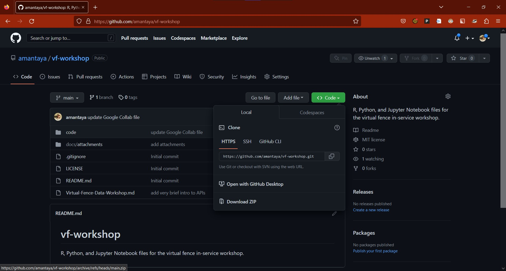
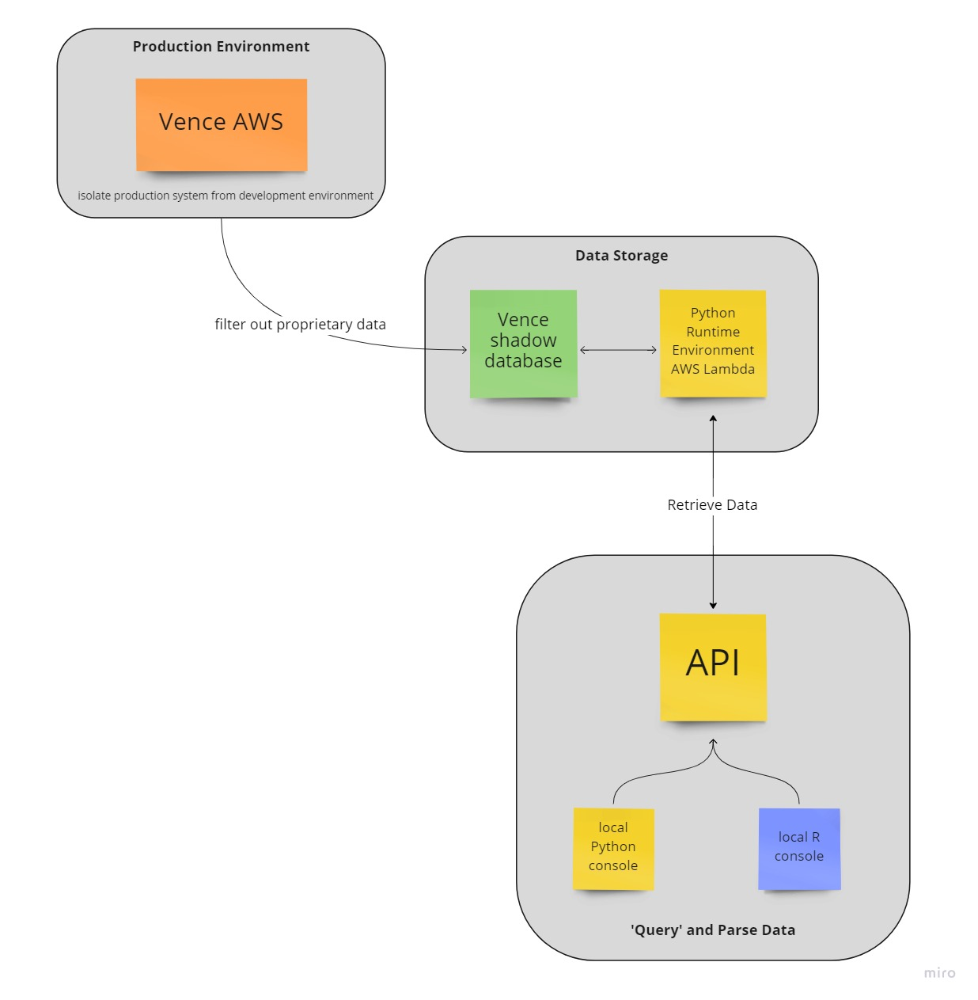
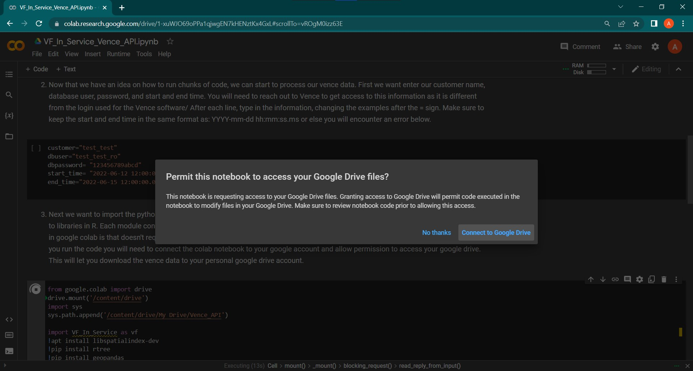
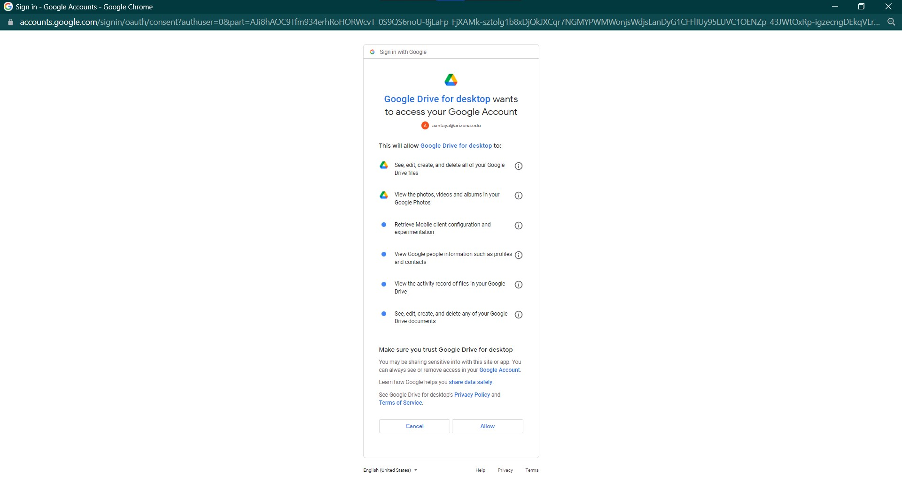

# Virtual Fence Data Workshop

This work is supported by the Agricultural Genome to Phenome Initiative AG2PI (*USDA-NIFA award 2021-70412-35233*).

## Important Links

1. [Workshop Code](https://github.com/amantaya/vf-workshop/tree/main/code)
2. [HackMD (for live coding assistance)](https://hackmd.io/@yW3saP0JQS-tB5uNp9cJ-Q/Hk7YL6Uhs/edit)
3. [Google Collab](https://colab.research.google.com/github/amantaya/vf-workshop/blob/main/code/VF_In_Service_Vence_API.ipynb)
4. [Virtual Fence Wrangling](https://github.com/Brandkmayer/VenceVFWrangling)
5. [Vence-API](https://github.com/amantaya/Vence-API)

## Prerequisites

Google Account with access to Google Drive and Google Collab.

## Setup

1. Install R (we're using version 4.2.2)
2. Install R Studio (we're using version 2022.12.0 Build 353)
3. [Optional] Install [Anaconda](https://www.anaconda.com/products/distribution) for Python
4. [Optional] [SQLite Studio](https://sqlitestudio.pl/)

We recommend that you download this GitHub repository as a zip (compressed) folder during the workshop. Click on the green "Code" button and select "Download ZIP"  to download a local copy.

## Shameless Plug

[grazeR](https://github.com/amantaya/grazeR) R package for grazing studies (in development).

## Understanding Virtual Fence Message Data

[Vence Data Definitions V2](https://docs.google.com/document/d/1mSkW57wWF59D9fOm_tbnTVByqaYR4UnV/edit)

## Accessing Virtual Fence Message Data with the API

APIs allow you to create, read, update, and delete data from another computer or server.

In our specific case, we can only read data from a server. The API controls access to virtual fence data through authentication. We need to supply the API with a username and password to retrieve data.

### Retrieving Virtual Fence Message Data Through the API

We have set up a Google Collab Notebook for this workshop. Google Collab is a free service that runs Jupyter Notebooks (which are similar to R Markdown notebooks) in the cloud. This means that you run Python in the cloud, not on your local computer. This has several advantages, including not tying up your computer's resources (CPU/Memory) to run a script, and in our case, you don't have to download packages/libraries to your local computer (making workshop setup much easier!).

Open the [Google Collab](https://colab.research.google.com/github/amantaya/vf-workshop/blob/main/code/VF_In_Service_Vence_API.ipynb) notebook. You may be prompted to sign in to your Google account, if not already signed in.

You will be prompted to grant permission for the Google Collab notebook to access all files on your Google Drive.

**Note: You need to be logged into the same Google account that you are mounting the Google Drive to. If you are using Google Chrome as your web browser, make sure you are logged into Chrome with the same Google account that you will be using to store data on your Google Drive.**

**Do not  use a Google Drive that contains sensitive or personal data**, as this grants full access to all of the files in your Google Drive (see image below). You can always create another free Google account to run this analysis to avoid granting access to your personal Google Drive files.

## Managing Virtual Fence Message Data with a Database

- simple to interface with in R/Python
- contain all data in a single file
  - don't need to read in multiple files each time
  - can become confusing quickly when there is a separate CSV file for virtual fences, virtual-herds, collars, etc
- can grow to very large size ~281 terabytes
- manage relationships, such as which cow has which collar

Why put together a standardized database?

- consistent data formats and meanings will make sharing analyses and collaboration MUCH easier
- much more conducive to a meta-analysis across institutions
- avoid having each research group 'reinvent the wheel' to develop one-off or proprietary data storage formats
- share analysis code that works (because data is in a standardized format)

Ultimately, we share similar processing steps and data storage problems, and where we can collaborate on these shared processing steps, we all are likely to benefit. Research goals for each individual or institution may differ, and the researcher will still have to figure out how to get their data into a format to answer their research question. But we can potentially speed up that process by providing a shared set of common processing steps that handle the data management and cleaning, and get you to analyzing the data more rapidly.

## Creating Virtual Fences in R

[VenceVFWrangling](https://github.com/Brandkmayer/VenceVFWrangling)

**Note: There is currently a bug on HerdManager where the points associated with virtual fences do not display properly on HerdManager. Engineers at Vence are aware of the issue and a fix is in the works.**

## Turning Virtual Fences Message Data into DataFrames in R